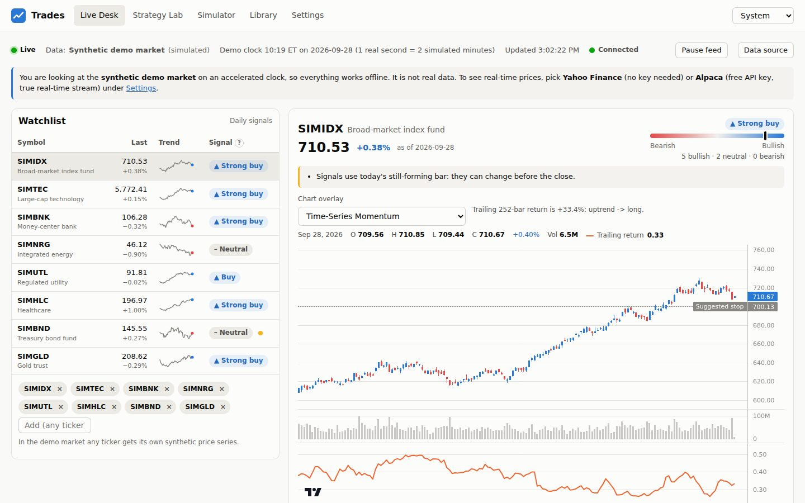
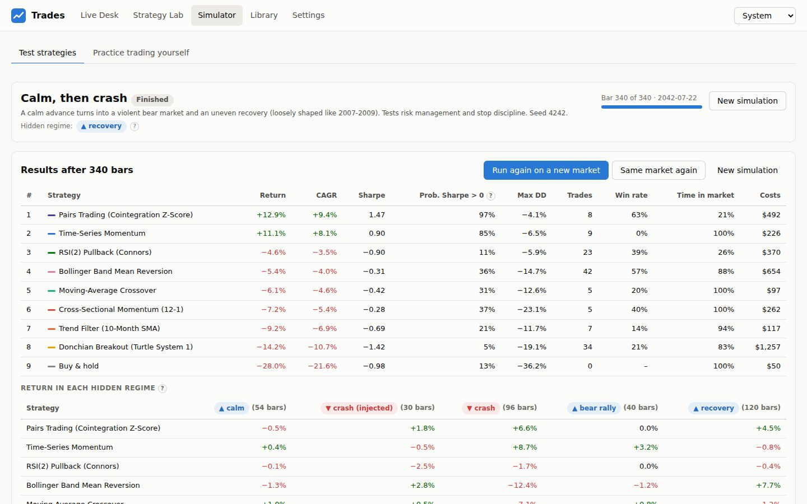
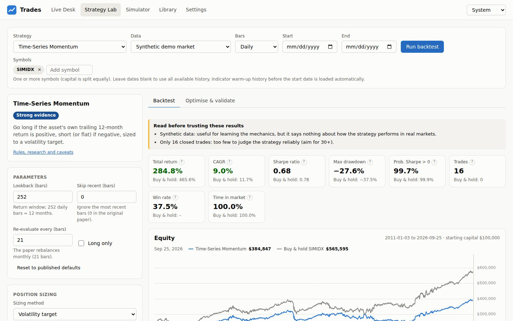
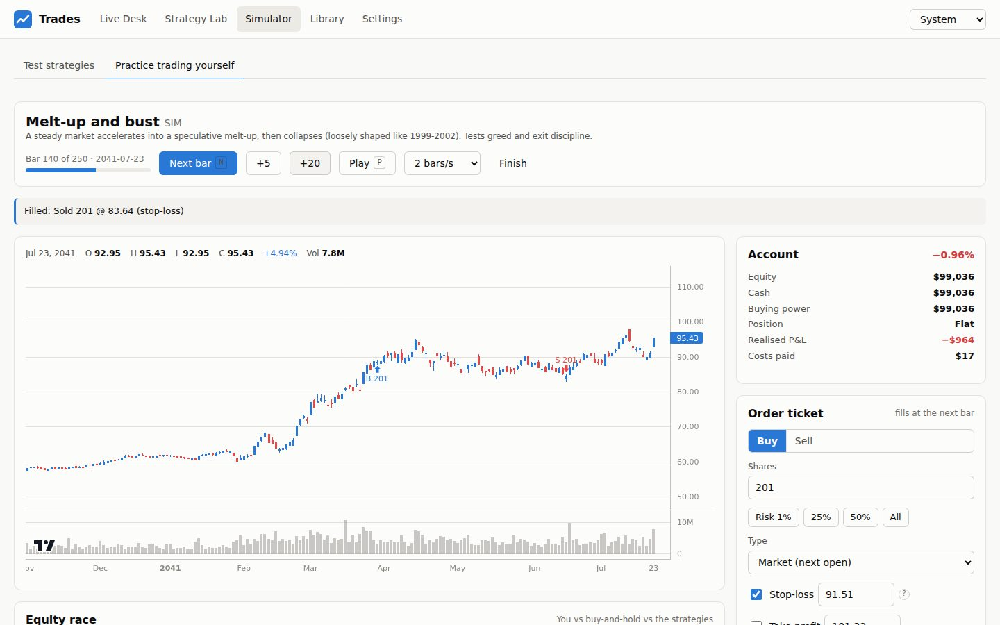
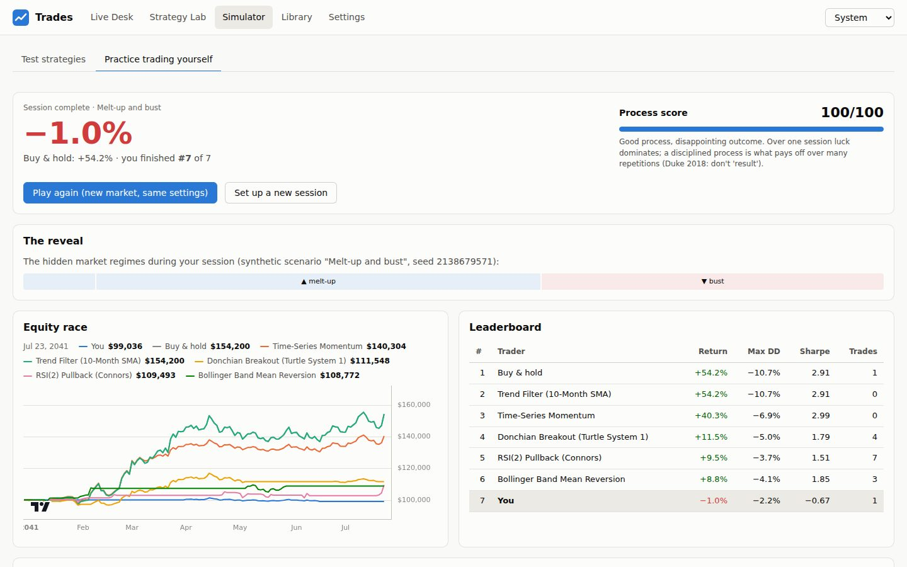
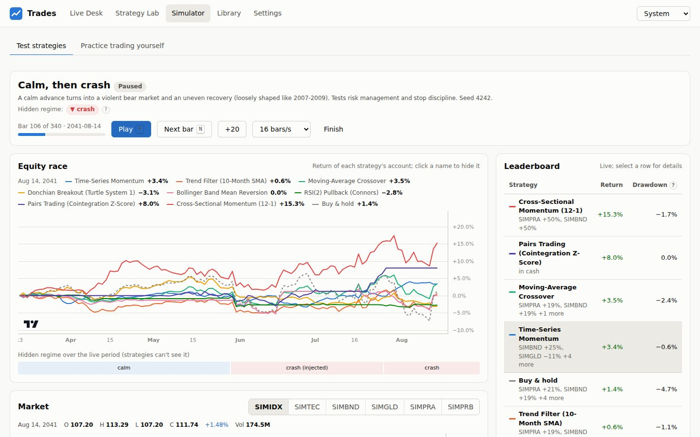
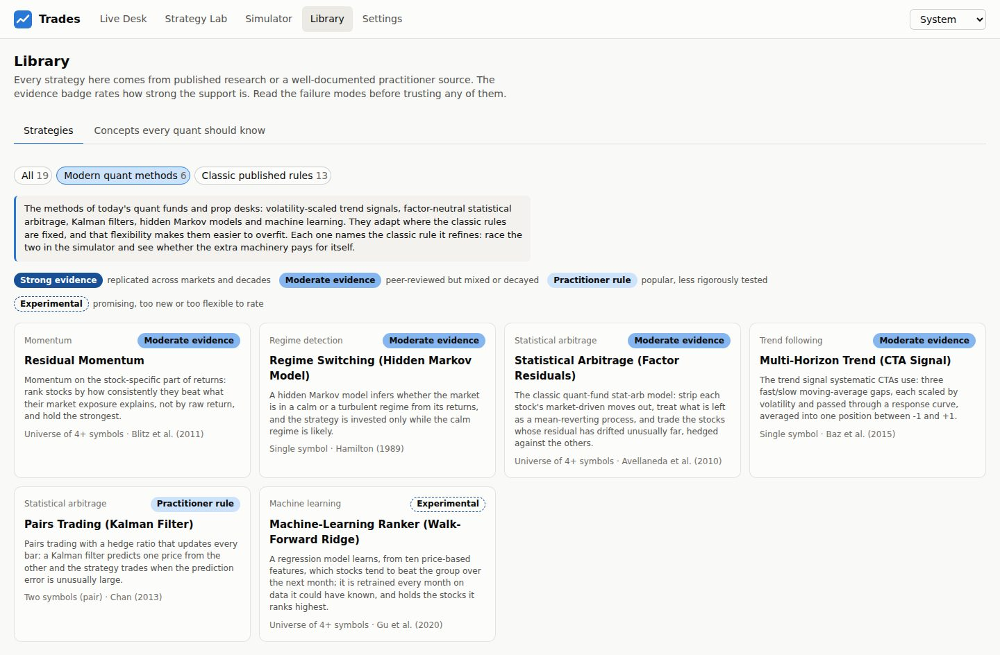
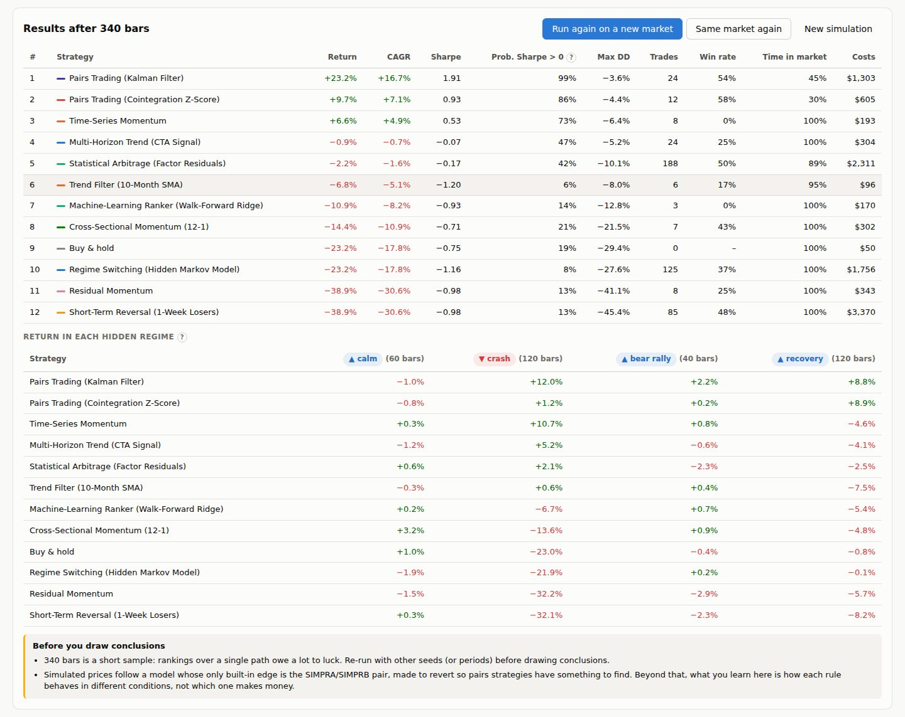

# Trades

**Quant strategy research, live strategy simulations, and real-time trade recommendations, in one web app you run
on your own computer or put online behind a password.**

Trades runs statistical strategies from published quantitative-finance research: classic rules (time-series
momentum, trend filters, Turtle breakouts, pairs trading, cross-sectional momentum, low volatility and more) and
the modern methods of quant funds and prop desks (a multi-horizon CTA trend signal, factor-neutral statistical
arbitrage, residual momentum, Kalman-filter pairs, a hidden Markov regime model and a walk-forward
machine-learning ranker). In the **strategy simulator**, every strategy trades its own paper account and reacts
bar by bar as the market moves, either a simulated market you can shock (crash, rally, volatility spike, broken
pair) or the connected real-time feed.
The Live Desk turns the same strategies into plain-language recommendations, the Strategy Lab backtests and
optimises them honestly, and a practice mode lets you trade yourself and get a scorecard on your *process*.

> **Recommendations only.** Trades never connects to a brokerage account and never places real orders.
> It is educational software, not investment advice.



## What's inside

| Area | What it does |
| --- | --- |
| **Strategy simulator** | Pick strategies and a market, press play. Each strategy decides at every bar's close using only the past and fills at the next open, in its own paper account, so you watch them react in real time. Markets: a **simulated market** (regime-switching, fat tails, volatility clustering, a cointegrated pair) where you can inject a crash, rally, volatility spike, forced regime, earnings gap or pair break mid-run; a **historical replay** at any speed; or a **real-time forward test** on Yahoo or Alpaca data, trading as each bar completes. A live leaderboard, equity race and a feed of every trade *with its reason*; at the end, risk-adjusted results and each strategy's return in every hidden regime. |
| **Live Desk** | Streams quotes for your watchlist (Yahoo Finance with no key, Alpaca real-time with a free key, or an offline demo market), runs every enabled strategy on each bar, and shows a consensus signal. Each strategy's vote comes with the rule it applied, how long the signal has held, its backtested record on *this* symbol, and a risk-based position size with a protective stop. |
| **Strategy Lab** | Backtests any strategy on any symbols and dates with realistic next-bar fills, slippage, commissions and short-borrow fees. Includes a buy-and-hold benchmark, drawdowns, monthly returns and trade lists. Parameter optimisation reports the **Deflated Sharpe Ratio** (how likely the "best" result is luck), and **walk-forward** testing scores parameters only on data the optimiser never saw. |
| **Practice trading** | Trade yourself, one bar at a time, with market, limit, stop and bracket (stop-loss/take-profit) orders. Choose synthetic scenarios (crash, bubble, chop, and more) or famous real periods such as 2008, COVID and the dot-com bust in **blind mode**, where ticker, dates, price level and volume are hidden until the end. You race the strategies, then get a scorecard covering outcome and process: stop usage, position sizing, cutting losses, the disposition effect, over-trading, and journaling. |
| **Library** | Rules, rationale, failure modes, evidence rating and references for every strategy, grouped into classic published rules and modern quant methods (each modern method links to the classic rule it refines, with one click to race the two), plus concise explainers on look-ahead bias, overfitting, survivorship bias, costs, the Sharpe ratio's uncertainty, position sizing and behavioural biases. |

| Strategy simulator: results by hidden regime | Strategy Lab |
| --- | --- |
|  |  |
| **Practice trading** | **Practice scorecard** |
|  |  |

## Strategy simulator



Open **Simulator -> Test strategies**, pick a market and a set of strategies, and press play:

- **Every strategy is an independent trader.** Each gets its own paper account and position sizing, decides at
  the close of each bar with only the bars so far, and fills at the next open with slippage, commissions, short
  borrow fees and margin interest. It is the same execution engine the backtester uses, and the test suite checks
  that a strategy traded live, bar by bar, produces exactly the equity curve of a backtest over the same bars,
  including after you inject events.
- **Steer a simulated market.** Bars come from a regime-switching model (bull, bear, range-bound, and scripted
  stories like "calm, then crash") with GARCH volatility clustering, fat-tailed shocks, jumps, a one-factor
  structure across stocks, and a cointegrated pair. Mid-run you can inject a **crash**, a **rally**, a
  **volatility spike**, a **forced regime**, an **earnings gap** in one stock, or a **pair break** (the spread
  moves to a new level for good, the way pairs trades blow up). Randomness is seeded per bar, so the same seed with
  and without your crash differs *only* by the crash: a controlled experiment.
- **Replay real history** from Yahoo, Alpaca, CSV files or the synthetic history at anything from half a bar to
  200 bars per second, or use **Replay bar by bar** on any Strategy Lab backtest.
- **Forward-test in real time.** Connect Yahoo Finance or Alpaca and choose a bar size (1 minute to daily): the
  strategies trade each bar as it completes on the live market, while the chart shows the bar still forming.
- **Pit modern methods against classic rules.** Quick picks load the classic rules, the modern quant methods, or
  each modern method next to the classic rule it refines ("Modern vs classic"). The warm-up lengthens
  automatically when a strategy needs more history (the machine-learning ranker needs about two years) so every
  strategy can trade from the first live bar.
- **See why.** The event feed lists every signal change and trade with the strategy's own reasoning ("Holding long
  from the last check 5 bars ago...", "Spread is rich (z = 2.36): short SIMPRA, long SIMPRB"), and the strategy
  panel shows each rule's current value.
- **Learn what the result means.** At the end: return, CAGR, Sharpe, probability that the Sharpe ratio is really
  above zero, drawdown, trades, costs, and each strategy's return inside every hidden regime, with cautions about
  reading too much into one path. Run the same market again with changed parameters, or a new market to see
  whether a ranking survives.

## Strategy library

### Classic published rules

| Strategy | Category | Evidence | Key reference |
| --- | --- | --- | --- |
| Time-series momentum | Trend following | Strong | Moskowitz, Ooi & Pedersen (2012), *JFE* |
| Trend filter (10-month SMA) | Trend following | Moderate | Faber (2007), *J. Wealth Management* |
| Moving-average crossover | Trend following | Moderate | Brock, Lakonishok & LeBaron (1992), *JF*; Sullivan, Timmermann & White (1999) |
| Donchian breakout (Turtle System 1) | Trend following | Moderate | Faith (2007), *Way of the Turtle* |
| Bollinger band mean reversion | Mean reversion | Practitioner | Bollinger (2001); Lehmann (1990) |
| RSI(2) pullback | Mean reversion | Practitioner | Connors & Alvarez (2008) |
| Pairs trading (cointegration z-score) | Statistical arbitrage | Moderate | Gatev, Goetzmann & Rouwenhorst (2006), *RFS*; Avellaneda & Lee (2010) |
| Cross-sectional momentum (12-1) | Momentum | Strong | Jegadeesh & Titman (1993), *JF*; Asness, Moskowitz & Pedersen (2013) |
| 52-week-high momentum | Momentum | Strong | George & Hwang (2004), *JF* |
| Dual momentum | Momentum | Practitioner | Antonacci (2014) |
| Low-volatility anomaly | Defensive factor | Strong | Ang et al. (2006), *JF*; Frazzini & Pedersen (2014), *JFE* |
| Short-term reversal | Mean reversion | Moderate | Lehmann (1990); Jegadeesh (1990); Avramov, Chordia & Goyal (2006) |
| Buy and hold | Benchmark | — | Sharpe (1991), *FAJ* |

### Modern quant methods

The tools of today's systematic funds and prop desks. They adapt where the classic rules are fixed, and that
flexibility makes them easier to overfit, so each one names the classic rule it refines: race the two in the
simulator and see whether the extra machinery pays for itself.

| Strategy | What it adds | Refines | Evidence | Key reference |
| --- | --- | --- | --- | --- |
| Multi-horizon trend (CTA signal) | Three fast/slow EMA gaps, volatility-normalised and passed through a response curve that fades overstretched moves; a continuous position | Time-series momentum | Moderate | Baz et al. (2015), Man Group; Lim, Zohren & Roberts (2019), *JFDS* |
| Statistical arbitrage (factor residuals) | Strips out each stock's market-driven moves, models the residual as an Ornstein-Uhlenbeck process, trades s-scores market-neutral with beta hedges | Short-term reversal | Moderate | Avellaneda & Lee (2010), *Quant. Finance*; Khandani & Lo (2011) |
| Residual momentum | Ranks stocks by the t-statistic of their stock-specific return, so a high-beta rally doesn't count as momentum | Cross-sectional momentum | Moderate | Blitz, Huij & Martens (2011), *J. Empirical Finance* |
| Pairs trading (Kalman filter) | The hedge ratio is a hidden state updated every bar; trades when the one-step forecast error is unusually large | Pairs trading (cointegration) | Practitioner | Chan (2013); Elliott, van der Hoek & Malcolm (2005), *Quant. Finance* |
| Regime switching (hidden Markov model) | Two-state Gaussian HMM fitted by EM (Baum-Welch), refitted monthly, filtered forward; invested while the calm regime is likely | Trend filter (10-month SMA) | Moderate | Hamilton (1989), *Econometrica*; Ang & Bekaert (2002), *RFS*; Nystrup et al. (2018) |
| Machine-learning ranker (walk-forward ridge) | Pooled cross-sectional ridge regression on ten price features, purged walk-forward retraining, live information coefficient | Cross-sectional momentum | Experimental | Gu, Kelly & Xiu (2020), *RFS*; Krauss, Do & Huck (2017); López de Prado (2018) |

The strategy panels explain each decision in the method's own terms: the s-score and mean-reversion time of a
residual, the filter's current hedge ratio and forecast error, the probability of the calm regime, or the model's
predicted relative return with the features driving it.

| Library: modern quant methods | Simulator: modern vs classic through a crash |
| --- | --- |
|  |  |

Position sizing is a separate, swappable layer: fixed allocation, **volatility targeting** (Moreira & Muir 2017),
or **ATR risk units** (the Turtles' fixed-fractional sizing).

## Quick start

Requirements: Python 3.10+ and Node.js 18+ (only needed to build the web UI).

```bash
python -m venv .venv && source .venv/bin/activate    # Windows: .venv\Scripts\activate
pip install -e .
cd web && npm install && npm run build && cd ..
trades serve                                          # open http://127.0.0.1:8000
```

The app starts on an offline **synthetic demo market** (clearly labelled, with an accelerated clock) so everything
works without an internet connection or API key. Switch to real data under **Settings**.

Or with Docker:

```bash
docker compose up --build                             # http://127.0.0.1:8000
```

For development with hot reload: run `trades serve` and, in another terminal, `cd web && npm run dev`
(then open http://localhost:5173). Common tasks are also in the `Makefile` (`make serve`, `make dev`, `make test`).

## Put it online (Render)

Trades is a server that has to keep running: it streams prices and simulator bars to your browser over WebSockets
and keeps simulations going between your clicks. Static and serverless hosts such as Vercel or Netlify can't run it
(a Vercel deploy shows a 404 page), but any host that runs a container can. This repository includes a blueprint
for [Render](https://render.com)'s free plan:

[](https://render.com/deploy?repo=https://github.com/jackr930/Trades)

1. Click the button and sign in to Render with your GitHub account.
2. When Render asks for `TRADES_PASSWORD`, choose a long password. Anyone who has it can use the app and change its
   settings.
3. Wait for the first build (about five minutes), open the `onrender.com` address Render shows, and log in.

Good to know about the free plan:

- The service sleeps after 15 minutes without visitors; the next visit takes about a minute to wake it up.
- It gets a fraction of a CPU core, so backtests and simulations run several times slower than on a laptop.
- There is no persistent disk: settings and practice history reset whenever the service restarts or redeploys. To
  make choices stick, set them as environment variables in the Render dashboard, for example `TRADES_PROVIDER=yahoo`
  to start on real market data, or `APCA_API_KEY_ID` and `APCA_API_SECRET_KEY` for Alpaca.

Other container hosts work the same way with the Dockerfile. The server listens on `$PORT` when it is set. To reach
it under another host name, add the name to `TRADES_ALLOWED_HOSTS` and set `TRADES_PASSWORD`: once outside host
names are allowed, Trades refuses to serve anything without a password. Set `TRADES_SECRET_KEY` to a long random
string so logins survive restarts. While nobody has the Live Desk open, the live feed pauses to save CPU and data
quota, and resumes as soon as someone does.

## Connecting real-time market data

| Provider | Key needed | Latency | Notes |
| --- | --- | --- | --- |
| **Yahoo Finance** (via `yfinance`) | No | Near real-time, polled | Decades of daily history; intraday limited to 7-60 days. Unofficial API, for personal use. |
| **Alpaca Market Data** | Free account | Real-time, streamed | Free plan uses the IEX exchange feed; a paid plan unlocks the consolidated SIP feed. Trades uses only Alpaca's *data* API, never its trading API. |
| **CSV files** | No | Static | Put `SYMBOL.csv` files (Date, Open, High, Low, Close, Volume) in `~/.trades/data`. |
| **Synthetic** | No | Simulated | Regime-switching GARCH market with jumps; not real data. |

To use Alpaca, create a free account at [alpaca.markets](https://alpaca.markets), generate a *paper trading* API
key (data access works with it), and paste the key ID and secret into **Settings**. Alternatively, set the
`APCA_API_KEY_ID` and `APCA_API_SECRET_KEY` environment variables.

Settings, including API keys, are stored locally in `~/.trades/settings.json` (override with `TRADES_HOME`) with
file mode 0600. Keys are masked whenever the UI reads them back. The server listens on `127.0.0.1` by default and
needs no login there; to make it reachable from other machines, use the password-protected setup in
[Put it online](#put-it-online-render).

## How results are kept honest

Backtests go wrong in predictable ways, and the engine is built to avoid the common traps:

- **No look-ahead bias.** Signals are computed from data up to a bar's close and filled at the *next* bar's open
  (or close). The test suite truncates the data at several points and checks that every strategy's past signals,
  indicators and position sizes never change when future bars are added.
- **Costs are always on.** Slippage (default 5 bps per fill), optional commissions and short-borrow fees. The Lab
  warns you when costs eat a large share of gross profits.
- **Statistics that tell you how much to trust a number.** Each backtest reports the Probabilistic Sharpe Ratio
  (Bailey & López de Prado 2012) alongside the Sharpe ratio. Parameter searches report the Deflated Sharpe Ratio
  (2014), and walk-forward analysis compares in-sample with out-of-sample results.
- **Models only learn from the past.** The hidden Markov model is refitted on trailing returns and run forward
  between refits. The machine-learning ranker trains only on rows whose target return was fully known before the
  prediction date (the purge gap), retrains on a rolling schedule, and reports its live out-of-sample information
  coefficient next to every prediction. The no-look-ahead test covers these models like every other strategy.
- **Plain-language warnings** for too few trades, short samples, probably-overfit results, synthetic data, and
  survivorship bias when you pick today's symbols to test the past.
- **Benchmarks everywhere.** Every backtest and simulator session is compared with buy-and-hold over the same period.
- **Leverage and shorting are not free.** Short positions pay a borrow fee (0.25%/yr by default), borrowed cash pays
  margin interest (2%/yr above cash, since returns are reported in excess of cash), and fills can't push gross
  exposure past the strategy's leverage cap after an overnight gap.
- **Live data stays clean.** Pre-market and after-hours prints never alter daily bars, a bar that is still forming
  is never fed into cached statistics, and forward tests trade only completed bars.

## Command line

```bash
trades strategies -v                                  # list strategies with references
trades backtest tsmom SPY --provider yahoo --start 2010-01-01
trades backtest pairs_trading KO PEP --provider yahoo --short
trades recommend AAPL MSFT NVDA --provider yahoo -v   # print recommendations
trades serve --port 8000
```

## Architecture

```
trades/
  core/        NYSE calendar, timeframes, indicators, statistics (PSR/DSR, ADF, cointegration), ledger
  data/        providers (synthetic, Yahoo, Alpaca, CSV), bar normalisation, cached data service
  strategies/  strategy framework + library, position sizing
  backtest/    event-driven engine, metrics, optimisation (grid + Deflated Sharpe, walk-forward)
  advisor/     ensemble recommendation engine with evidence and risk-based sizing
  arena/       strategy simulations: steerable simulated market, replay/real-time feeds, strategy agents
  sim/         paper broker, practice sessions, behavioural scorecard
  live/        live service: quotes -> forming bars -> recommendations -> WebSocket
  api/         FastAPI REST + WebSocket, serves the built UI
web/           React + TypeScript + Vite UI (charts: TradingView lightweight-charts)
tests/         pytest suite
```

Data flows one way. A provider supplies bars; a strategy turns them into signals; the sizing layer turns signals
into target weights; an `ExecutionEngine` turns target weights into fills, one bar at a time. The backtester, the
strategy simulator's agents and the practice mode's strategy "ghosts" all use that path, and the live recommender
uses the same signals and sizing, so what you research is exactly what gets simulated and recommended.

The REST and WebSocket API is documented at `http://127.0.0.1:8000/docs` while the server runs.

## Adding your own strategy

A single-symbol strategy is a small class: declare its parameters and metadata, then compute a `signal` column
(+1 long, -1 short, 0 flat) using only data up to each bar. Register it in `trades/strategies/__init__.py`, and it
appears in the Lab, the Live Desk and the Simulator.

```python
import numpy as np
import pandas as pd

from trades.core import indicators as ind
from trades.strategies.base import Evidence, Param, Reference, SingleAssetStrategy


class RSITrend(SingleAssetStrategy):
    id = "rsi_trend"
    name = "RSI trend (example)"
    category = "Trend following"
    summary = "Long while 14-bar RSI is above 55, flat below 45."
    rules_text = ("RSI(14) > 55 -> long", "RSI(14) < 45 -> flat")
    rationale = "Momentum persists over short horizons."
    failure_modes = "Choppy markets."
    evidence = Evidence.PRACTITIONER
    evidence_text = "Illustrative example, not a researched strategy."
    references = (Reference("Wilder, J. W.", 1978, "New Concepts in Technical Trading Systems", "Trend Research"),)
    params_spec = (Param("length", "RSI length", 14, "int", 2, 50),)

    def warmup(self) -> int:
        return self.params["length"] + 1

    def compute(self, df: pd.DataFrame) -> pd.DataFrame:
        r = ind.rsi(df["close"], self.params["length"])
        raw = pd.Series(np.where(r > 55, 1.0, np.where(r < 45, 0.0, np.nan)), index=df.index)
        return pd.DataFrame({"signal": raw.ffill(), "rsi": r}, index=df.index)
```

The parametrised no-look-ahead test in `tests/test_strategies.py` runs against every registered strategy
automatically, so a rule that peeks at future bars fails the test suite.

## Development

```bash
pip install -e ".[dev]"
pytest                      # Python tests
ruff check trades tests     # lint
cd web && npm run build     # type-check and build the UI
```

## Limitations

- US equities and ETFs only (NYSE calendar); no options, futures or crypto.
- The fill model is bar-based: no partial fills, volume limits or queue position. Intrabar order of stop-loss and
  take-profit hits is unknown, so the stop is assumed to fill first.
- Free data has gaps: Yahoo is an unofficial API, Alpaca's free IEX feed covers one exchange, and neither offers a
  survivorship-free historical universe.
- Simulations and practice sessions live in memory (completed practice summaries are saved), and the app is
  single-user. Real-time forward tests run while the server runs; they poll the provider rather than stream.
- Published strategies weaken after publication (McLean & Pontiff 2016). Treat them as disciplined baselines, not
  guarantees.

## Disclaimer

For education and research only. Nothing here is investment advice or a recommendation to buy or sell any
security. Past performance, and especially backtested performance, does not predict future results. Trading
involves risk of loss.
